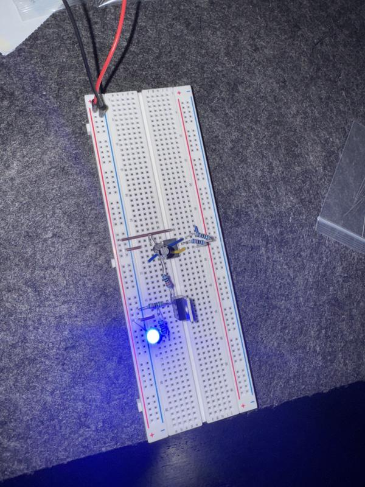
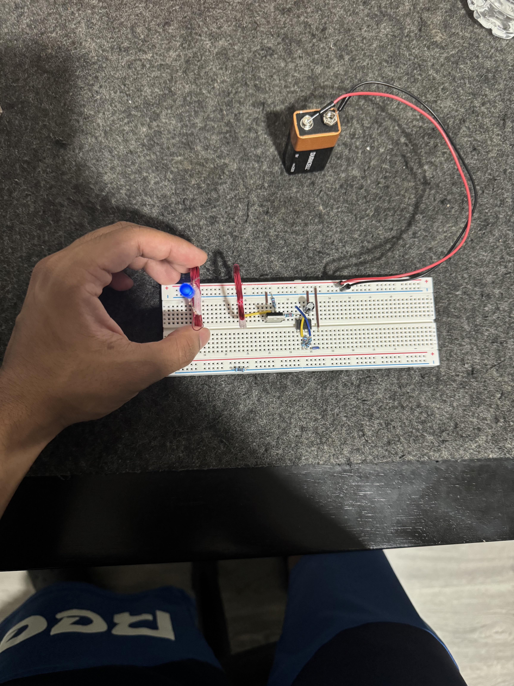
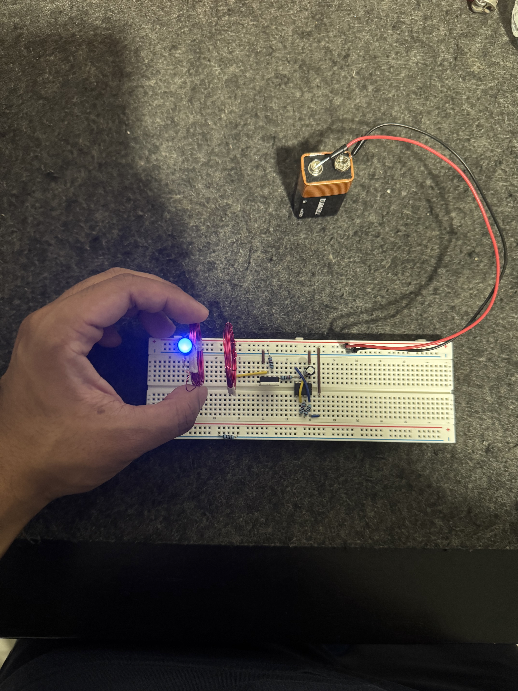
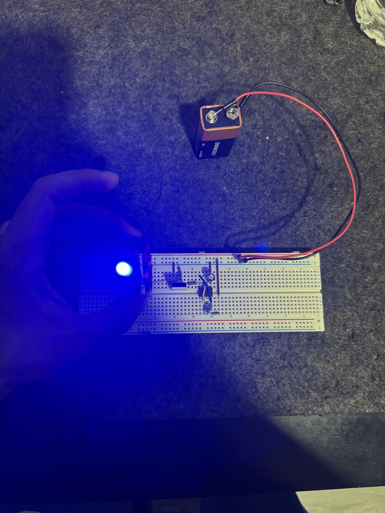

# Wireless Charger using 555 Timer & MOSFET

This project demonstrates a simple wireless charger built using a 555 timer and a MOSFET on a breadboard.

## 🔧 Components Used
- 555 Timer IC
- RFP30N06LE MOSFET
- Handmade Copper coil 
- Capacitors & resistors
- LEDs
- 9V battery

## 🧪 What It Does
The 555 timer creates a PWM signal which drives a MOSFET. The MOSFET switches current through a transmitter coil to wirelessly power an LED on the receiver side.

## 📸 Images
Images and index.html page show the working demo and steps.

## 🧠 Skills Learned
- Circuit design
- Breadboarding
- Wireless energy transfer

## 🔋 Wireless Charger Demo

